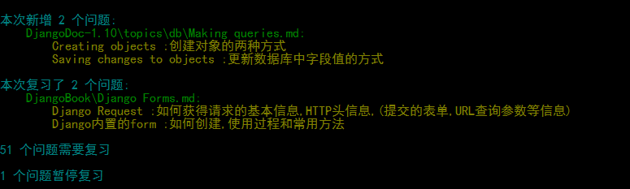

# SmartNote

## 简介

smart note 是一个帮助你复习笔记的工具.

如果你是记录的笔记以文件的形式保存在电脑上,并且所使用的笔记格式是可以解析的,那么只需要在记录笔记的时候加入一些简单的标记,就可以让smart note在恰当的时候提醒你复习. 


图中所使用的编辑器为[Typora](https://typora.io/)

## 快速开始

### 安装smart note

下载打包好的[smart note](https://github.com/jefffffrey/smart-note/releases/download/v0.1.0/SmartNote-0.1.0.zip),将其解压到电脑上,之后执行文件夹中的SET_PATH.bat将该目录加入到环境变量(之后可以在系统任何地方执行note命令).

安装好note之后即可:

1. `note init` 创建工作空间
2. 写笔记,执行`note status`确认添加的笔记(该步骤可以跳过),之后执行`note commit`
3. 每天需要复习笔记的时候,执行`note status` ,然后进入TASK目录复习,复习完毕之后执行`note commit`

### 创建工作空间

工作空间即note用来存放用户数据的地方,这些数据包括:用户记录的笔记,和复习笔记相关的数据,程序日志,用户配置文件.

初始化工作空间的方式为创建一个目录,之后在目录中执行`note init` 命令,初始的工作空间的目录结构如下:

```sh
notes/
|---.NOTE/
|   |---db # 复习相关的信息
|   |---log # 日志
|   |---ignore # ignore配置,下文会讲到
|---TASK/ # 需要复习的笔记的快捷方式   
```

### 写笔记

此时就可以在notes目录下面创建笔记,比如我们创建了一个hello-smart-note.md文件,内容如下:

```markdown
# What is smart note ?
smart note 是一个帮助你复习笔记的工具.
```

现在我们执行`note status`命令查看一下工作空间的状态,结果如下:

 

note 通过标题末尾的问号识别出了需要加入复习计划的条目,在执行`note commit`之后note将把该条目加入复习计划.

加入复习计划后,会发现hello-smart-note.md文件内容发生了变化:

```markdown
# What is smart note    [❓](SOH0000001EOT)  
smart note 是一个帮助你复习笔记的工具.
```

文档中出现了`[❓](SOH0000001EOT)` 这个的字符串,不要担心.如果你用markdown编辑器打开,会发现该部分会被渲染成[❓]().

note 对写笔记唯一的限制就是无法在标题的末尾使用note 用来作为控制字符的符号,如:`?` 

### 复习笔记

当条目已经加入复习计划之后,note会在恰当的时间提醒你复习.执行`note status`命令,如果今天有需要复习的内容,note会给出相应的提示,并且把包含复习条目的笔记链接放置在TASK目录下.

进入TASK目录打开文件,会发现之前的[❓]()变成了[🔔](),该符号用来提示条目需要复习.之后在🔔后面添加符号告诉note你的复习结果:

- 如果记得,标注V
- 如果不记得,标注X

完成标注后执行`note status`查看所作出的改变.确认之后执行`note commit`提交即可.



## 支持情况

- 文件格式支持:程序默认以UTF-8格式打开文件，因此请使用与UTF-8兼容的格式编写笔记,如:ASCII
- 笔记格式支持:目前仅支持markdown格式
- 操作系统支持:目前仅支持Windows操作系统

## 更多资料

本文只介绍了note的基础用法,更多note的命令以及控制方式参考[详细文档](./使用说明.md)

## 参与

如果你对smart note感兴趣,并且想要smart note变得更好,你可以:

- 在Issue页面提交你遇到的问题,你想要的功能,你觉得不满意的地方...
- 加入QQ群310332431交流
- Fork项目参与开发,参考[开发文档](./开发文档.md)

