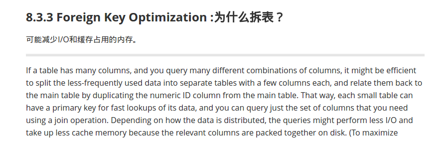
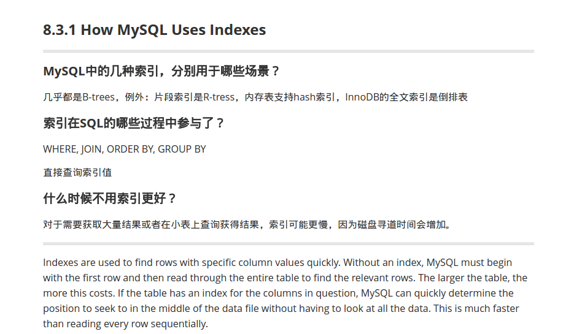
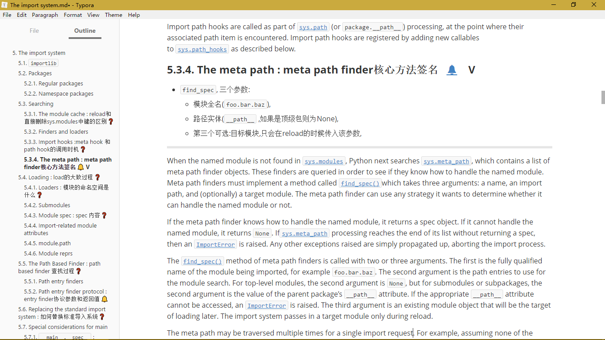

# 使用SmartNote复习笔记

个人觉得可以把记笔记的方式简单的分为两类。一类是读书，然后单独在一个地方记下笔记；另一中就是直接在书中内容旁边记笔记。个人推荐其中的第二种方式，下面是两个主要的原因：

1. 可以减少大量的抄写。如果单独在一个地方记笔记往往需要抄写很多书中的内容。
2. 复习的时候，可以很容易的找到上下文帮助巩固和复习。由于笔记往往是总结性质的，但是一条笔记并不是一成不变的。比如第一次看一份材料，有了一个见解或者总结，记下来。那么第二次看到这个总结的时候如果觉得有点难懂或者有点不够好，那么可以很方便的阅读上下文再次深化总结。

## 记笔记的目的

记笔记的目的可以大致分为两类：

1. 记录下来，方便以后查询。
2. 记录下来，方便自己复习。和前者的主要区别是，前者记得笔记可能是今后很少会用到的，到时候用的时候再查，而这种为了复习而记录的笔记则是为了让笔记中的知识保留在自己的记忆中。

而谈到复习就有一个复习效率的问题。复习的太频繁浪费时间，复习的间隔太远可能内容全都忘记了。人的记忆是很复杂的东西，但是也有一定的规律可循，所有就有很多较为符合人的记忆规律的复习算法产生了。借助于现在的计算机，我们很容易将这些算法应用到我们的学习中来，从而提高我们的学习效率。

## SmartNote的诞生

为了方便在复习电脑上记下来的笔记，我开发了SmartNote这个软件。下面简单的介绍一下该软件的想法以及用法。

### 想法

首先目前记笔记的方式多种多样，比如有的人用word记笔记，有的人用云笔记保存网页然后记笔记，还有的人在阅读PDF的过程中在文中做一些标记。每一种方式都有各自的便利之处，都能满足不同人的记笔记需求。然而针对各种笔记方式，目前并没有一个很好的复习策略。所以，SmartNote将要解决的问题就是如何帮助人们复习各种材料上的笔记。

使用SmartNote，你需要确保你的笔记类型是[QA](https://web.wpi.edu/Images/CMS/ARC/Notecard_Question.pdf)类型，简单的说就是一个问题和一个回答的组合。QA类型的笔记是更适合人们记忆的类型，如果你还没有尝试过，一定不要错过了。简单的例子：

```markdown
Q: 中国有多少个省？
A: 23个
```

由于本人目前使用Markdown记的笔记，所以目前SmartNote只支持markdown笔记的复习，本文接下来的例子都以markdown为准。由于本人业余时间较少，其他类型的笔记支持暂时不会实现，只能期待各位小伙伴的帮助了。

### 用法

首先，我们需要让SmartNote知道你需要Question。在Markdown中，我们约定所有的Q必须是标题，另外后面的`？`表示让SmartNote安排复习。

使用标题作为Q的原因是因为大多编辑器都会提供按照标题导航的功能，因此复习的时候可以通过浏览目录定位到笔记。

下面是我常用的两种方式： 这种方式通常是读完一部分，然后有一个需要记住的知识点，然后为了方便直接在标题后加上Q，然后下面写出大概的回答。如果读完一部分发现提出很多问题，或者不想记在原始标题上，那么可以采用下面这种方式。当然你也可以将新标题直接创建到原文中详细讲解的地方。



SmartNote将会在笔记需要复习的时候提醒你，如下：



SmartNote在需要复习的部分后面追加提醒符，你可以很容易的通过目录找到他们。

具体的使用方法请阅读：[使用说明](https://jefffffrey.github.io/smart-note/%E4%BD%BF%E7%94%A8%E8%AF%B4%E6%98%8E%E4%B9%A6.html)

## 邀请

个人使用SmartNote一段时间了，SmartNote帮我记住了很多知识点，效果很不错。所以欢迎大家的尝试和建议，另外如果你是开发人员，那么很期待你的加入。

